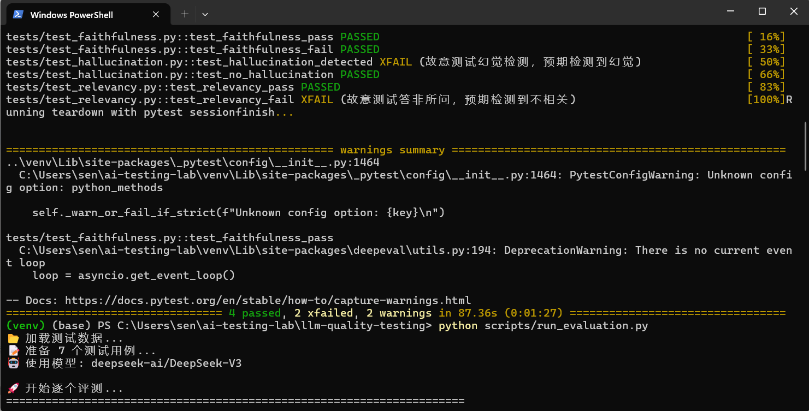
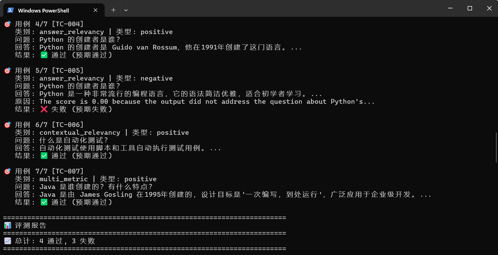

# 🧪 LLM 质量测试平台（DeepEval + SiliconFlow）

> 大二软件工程学生的 AI 大模型质量测试实践项目  
> 技术栈：Python | DeepEval | pytest | SiliconFlow API | Ollama 

## 📌 项目简介

本项目基于 [DeepEval](https://github.com/confident-ai/deepeval) 框架，使用 **SiliconFlow** 提供的大模型 API 作为评测模型（LLM-as-a-Judge），对 LLM 输出进行自动化质量评估。

同时支持 **Ollama 本地模型**作为备用方案，无需网络即可运行测试。

### 评测指标覆盖

| 指标 | 说明 | 适用场景 |
|------|------|----------|
| Faithfulness | 忠实度 | RAG 回答是否忠实于检索上下文 |
| Hallucination | 幻觉检测 | 回答是否包含虚构信息 |
| Answer Relevancy | 答案相关性 | 回答是否切题 |
| Contextual Relevancy | 上下文相关性 | 检索到的上下文是否相关 |

## 📸 测试结果

### pytest 自动化测试


### 批量评测报告


## 🚀 快速开始

### 环境要求
- Python 3.10+
- SiliconFlow API Key（[免费注册](https://cloud.siliconflow.cn)）或 Ollama 本地模型

### 安装依赖

```bash
# 克隆项目
git clone https://github.com/sen998/llm-quality-testing.git
cd llm-quality-testing

# 创建虚拟环境
python -m venv venv

# 激活虚拟环境
# Windows:
venv\Scripts\activate
# Mac/Linux:
source venv/bin/activate

# 安装依赖
pip install -r requirements.txt
```

### 配置 API Key

```bash
# 复制环境变量模板
cp .env.example .env

# 编辑 .env 文件，填入你的 SiliconFlow API Key
# SILICONFLOW_API_KEY=sk-your-key-here
```

### 运行测试

```bash
# 运行全部测试（使用 SiliconFlow）
pytest tests/ -v

# 运行单个测试文件
pytest tests/test_faithfulness.py -v

# 生成 HTML 测试报告
pytest tests/ -v --html=report.html

# 运行批量评测脚本
python scripts/run_evaluation.py
```

### 使用本地 Ollama（无需 API Key）

```bash
# 安装 Ollama：https://ollama.com/download
# 拉取模型
ollama pull qwen:1.8b

# 启动服务
ollama serve

# 修改代码中的模型为 qwen:1.8b，然后运行测试
pytest tests/ -v
```

## 🏗️ 项目结构

```
llm-quality-testing/
├── .github/workflows/     # GitHub Actions CI/CD
├── src/                   # 源码（指标配置、数据生成器）
├── tests/                 # 测试用例
├── data/                  # 测试数据（JSON）
├── scripts/               # 批量评测脚本
├── docs/images/           # 文档截图
├── .env.example           # 环境变量模板
├── requirements.txt       # 依赖
└── README.md              # 项目文档
```

## 📝 学习笔记

| 阶段 | 内容 | 状态 |
|------|------|------|
| Week 1 | DeepEval 基础环境搭建 | ✅ |
| Week 2 | 核心指标评测实战 | ✅ |
| Week 3 | RAG 系统专项测试 | 🚧 |
| Week 4 | 安全测试 + 项目整合 | 🚧 |

## 🔗 相关链接

- [DeepEval 官方文档](https://docs.confident-ai.com/)
- [SiliconFlow 官网](https://siliconflow.cn/)
- [Ollama 官网](https://ollama.com/)

## 📄 License

MIT
